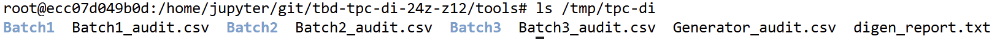
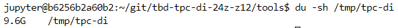

IMPORTANT ❗ ❗ ❗ Please remember to destroy all the resources after each work session. You can recreate infrastructure by creating new PR and merging it to master.


0. The goal of this phase is to create infrastructure, perform benchmarking/scalability tests of sample three-tier lakehouse solution and analyze the results using:
* [TPC-DI benchmark](https://www.tpc.org/tpcdi/)
* [dbt - data transformation tool](https://www.getdbt.com/)
* [GCP Composer - managed Apache Airflow](https://cloud.google.com/composer?hl=pl)
* [GCP Dataproc - managed Apache Spark](https://spark.apache.org/)
* [GCP Vertex AI Workbench - managed JupyterLab](https://cloud.google.com/vertex-ai-notebooks?hl=pl)

Worth to read:
* https://docs.getdbt.com/docs/introduction
* https://airflow.apache.org/docs/apache-airflow/stable/index.html
* https://spark.apache.org/docs/latest/api/python/index.html
* https://medium.com/snowflake/loading-the-tpc-di-benchmark-dataset-into-snowflake-96011e2c26cf
* https://www.databricks.com/blog/2023/04/14/how-we-performed-etl-one-billion-records-under-1-delta-live-tables.html

2. Authors:

**z12**

*Jan Budziński*  
*Marcin Godniak*  
*Kacper Klassa*  

**https://github.com/kklassa/tbd-workshop-1-24z-z12**

3. Sync your repo with https://github.com/bdg-tbd/tbd-workshop-1.

4. Provision your infrastructure.

    a) setup Vertex AI Workbench `pyspark` kernel as described in point [8](https://github.com/bdg-tbd/tbd-workshop-1/tree/v1.0.32#project-setup)

    b) upload [tpc-di-setup.ipynb](https://github.com/bdg-tbd/tbd-workshop-1/blob/v1.0.36/notebooks/tpc-di-setup.ipynb) to
the running instance of your Vertex AI Workbench

5. In `tpc-di-setup.ipynb` modify cell under section ***Clone tbd-tpc-di repo***:

   a)first, fork https://github.com/mwiewior/tbd-tpc-di.git to your github organization.

   b)create new branch (e.g. 'notebook') in your fork of tbd-tpc-di and modify profiles.yaml by commenting following lines:
   ```
        #"spark.driver.port": "30000"
        #"spark.blockManager.port": "30001"
        #"spark.driver.host": "10.11.0.5"  #FIXME: Result of the command (kubectl get nodes -o json |  jq -r '.items[0].status.addresses[0].address')
        #"spark.driver.bindAddress": "0.0.0.0"
   ```
   This lines are required to run dbt on airflow but have to be commented while running dbt in notebook.

   c)update git clone command to point to ***your fork***.


6. Access Vertex AI Workbench and run cell by cell notebook `tpc-di-setup.ipynb`.

    a) in the first cell of the notebook replace: `%env DATA_BUCKET=tbd-2023z-9910-data` with your data bucket.


   b) in the cell:
         ```%%bash
         mkdir -p git && cd git
         git clone https://github.com/mwiewior/tbd-tpc-di.git
         cd tbd-tpc-di
         git pull
         ```
      replace repo with your fork. Next checkout to 'notebook' branch.

    c) after running first cells your fork of `tbd-tpc-di` repository will be cloned into Vertex AI  enviroment (see git folder).

    d) take a look on `git/tbd-tpc-di/profiles.yaml`. This file includes Spark parameters that can be changed if you need to increase the number of executors and
  ```
   server_side_parameters:
       "spark.driver.memory": "2g"
       "spark.executor.memory": "4g"
       "spark.executor.instances": "2"
       "spark.hadoop.hive.metastore.warehouse.dir": "hdfs:///user/hive/warehouse/"
  ```


7. Explore files created by generator and describe them, including format, content, total size.

   The generator created three batches of files.
   The files are of four formats: CSV, TXT, XML, and raw text.

   

   The files contain financial transactional data divided by year and further by quarter.
   The files are a part of the TPC-DI benchmark dataset.
   Most notably they contain the files: `Date.txt`, `DailyMarket.txt`, `Industry.txt`, `Prospect.csv`, `CustomerMgmt.xml`, `TaxRate.txt`, `HR.csv`, `WatchHistory.txt`, `Trade.txt`, `TradeHistory.txt`, `StatusType.txt`, `TradeType.txt`, `HoldingHistory.txt`, `CashTransaction.txt` and many files with `FINWIRE` prefix.

   The total size of files is 9.6GB.
   

8. Analyze tpcdi.py. What happened in the loading stage?

   The `tpcdi.py` file contains a script used to load data from TPC-DI data integration benchmark that was generated in the previous step into a Data Lakehouse environment in GCP GCS. 
   The main logic happens in the `process_files` function. This function first defines some utility inner functions for saving DataFrames as tables, uploading files to the stage bucket and loading a DataFrame from CSV files stored in the stage. Then it processes each of the files listed in previous section. For each file, a corresponsing table is created except for the `FINWARE` files which are used to create a temporary table from which `CMP`, `SEC` and `FIN` tables are created.
   Here is the final list of created table names:
   - DATE
   - DAILY_MARKET
   - INDUSTRY
   - PROSPECT
   - CUSTOMER_MGMT
   - TAX_RATE
   - HR
   - WATCH_HISTORY
   - TRADE
   - TRADE_HISTORY
   - STATUS_TYPE
   - TRADE_TYPE
   - HOLDING_HISTORY
   - CASH_TRANSACTION
   - CMP
   - SEC
   - FIN

9.  Using SparkSQL answer: how many table were created in each layer?


10. Add some 3 more [dbt tests](https://docs.getdbt.com/docs/build/tests) and explain what you are testing. ***Add new tests to your repository.***

   ***Code and description of your tests***

11. In main.tf update
   ```
   dbt_git_repo            = "https://github.com/mwiewior/tbd-tpc-di.git"
   dbt_git_repo_branch     = "main"
   ```
   so dbt_git_repo points to your fork of tbd-tpc-di.

12. Redeploy infrastructure and check if the DAG finished with no errors:

***The screenshot of Apache Aiflow UI***
