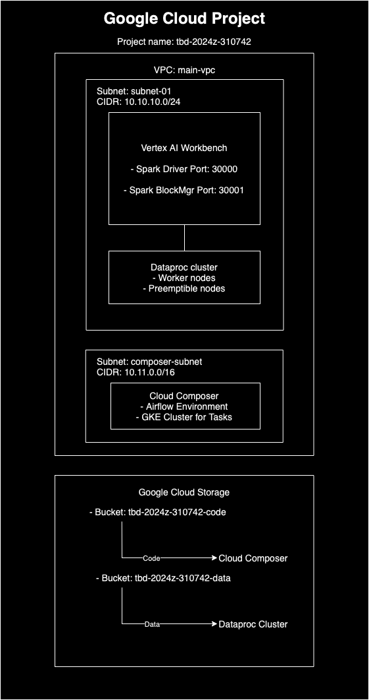
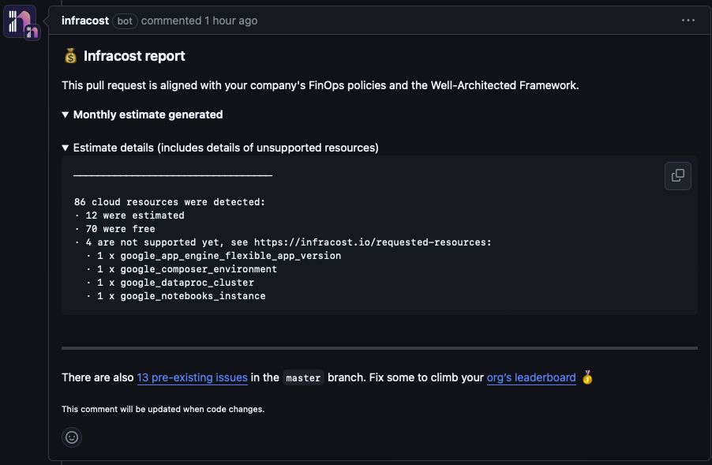
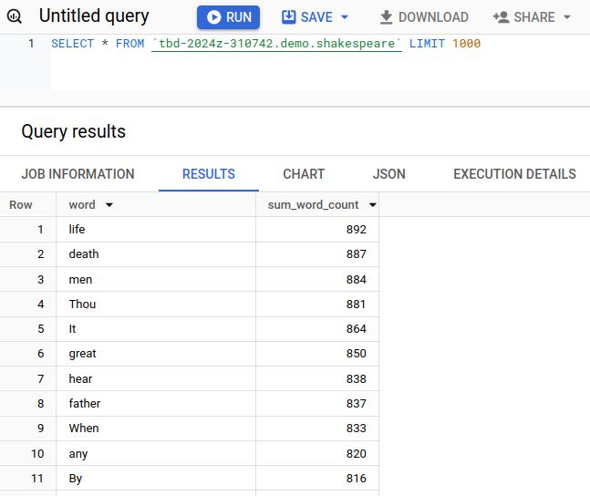
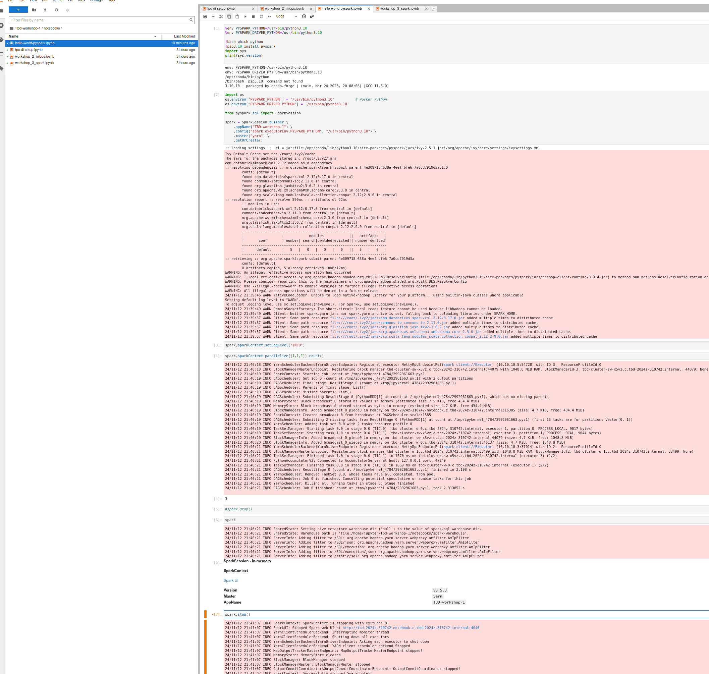
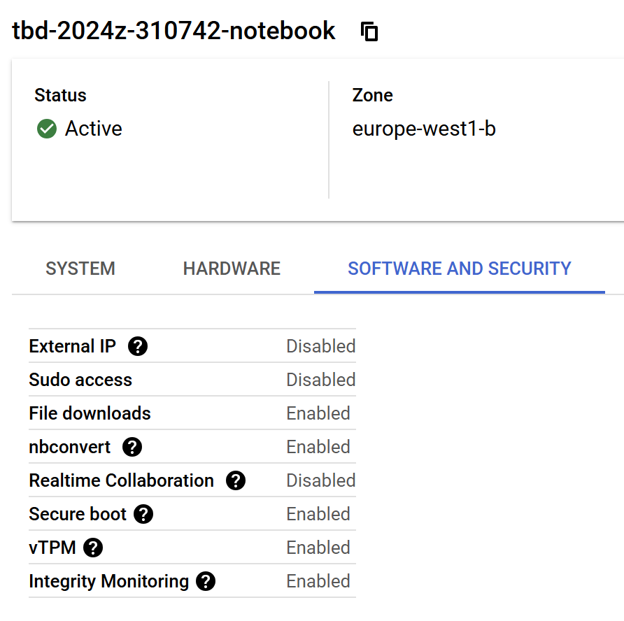
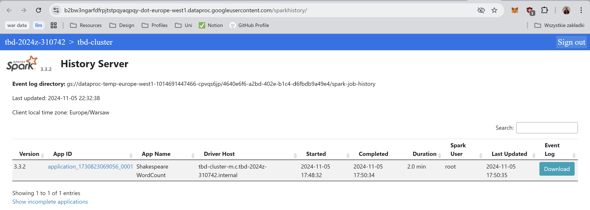

IMPORTANT ❗ ❗ ❗ Please remember to destroy all the resources after each work session. You can recreate infrastructure by creating new PR and merging it to master.


1. Authors:

**z12**

*Jan Budziński*  
*Marcin Godniak*  
*Kacper Klassa*  

**https://github.com/kklassa/tbd-workshop-1-24z-z12**

2. Follow all steps in README.md.

3. Select your project and set budget alerts on 5%, 25%, 50%, 80% of 50$ (in cloud console -> billing -> budget & alerts -> create buget; unclick discounts and promotions&others while creating budget).

  

5. From avaialble Github Actions select and run destroy on main branch.

6. Create new git branch and:
    1. Modify tasks-phase1.md file.

    2. Create PR from this branch to **YOUR** master and merge it to make new release.

    


7. Analyze terraform code. Play with terraform plan, terraform graph to investigate different modules.

    **Data Pipeline module**:

    This module is responsible for creating and configuring Google Cloud Storage buckets which are used for
    storing scripts that are utilized by the data pipeline based on Apache Airflow. Two buckets are created
    by the module - one is storing code for a Spark job (`tbd-code-bucket`) and the other is for storing
    pipeline data (`tbd-data-bucket`). Resources responsible for IAM bindings to those buckets for service
    accounts are also configured and provisioned, as well as a GCS bucket object for the code bucket.

    The following diagram presents the dependencies between resources created by the module:

    

    Interestingly not all resources of type `google_storage_bucket_object` are connected to a `google_storage_bucket` resource. That is because the `dag-code` and `dbt-dag-code` bucket objects are a part of a diffreent bucket that is provisioned by [`composer`](modules/composer/) module. These bucket objects contain scripts with DAGs for Apache Airflow.


8. Reach YARN UI

  The command that was used to set up the tunnel:
  ```bash
  gcloud compute ssh tbd-cluster-m \
  --project=tbd-2024z-310742 \
  --zone=europe-west1-d -- -D 1080 -N
  ```
  With the tunnel open, YARN UI was accessible at http://tbd-cluster-m:8088.

  

9.  Draw an architecture diagram (e.g. in draw.io) that includes:
    1. VPC topology with service assignment to subnets
    2. Description of the components of service accounts
    3. List of buckets for disposal
    4. Description of network communication (ports, why it is necessary to specify the host for the driver) of Apache Spark running from Vertex AI Workbech

  

10. Create a new PR and add costs by entering the expected consumption into Infracost
For all the resources of type: `google_artifact_registry`, `google_storage_bucket`, `google_service_networking_connection`
create a sample usage profiles and add it to the Infracost task in CI/CD pipeline. Usage file [example](https://github.com/infracost/infracost/blob/master/infracost-usage-example.yml)

```yaml
usage:
  google_artifact_registry.registry:
    storage_gb: 50

  google_storage_bucket.tbd_code_bucket:
    storage_gb: 100
    monthly_class_a_operations: 1000
    monthly_class_b_operations: 500
    monthly_egress_data_gb: 50

  google_storage_bucket.tbd_data_bucket:
    storage_gb: 200
    monthly_class_a_operations: 1500
    monthly_class_b_operations: 800
    monthly_egress_data_gb: 100

  google_service_networking_connection.private_vpc_connection:
    monthly_data_processed_gb: 300
```



11.  Create a BigQuery dataset and an external table using SQL

  ```sql
  REATE SCHEMA IF NOT EXISTS demo OPTIONS(location = 'europe-west1');
  
  CREATE OR REPLACE EXTERNAL TABLE demo.shakespeare
    OPTIONS (
    
    format = 'ORC',
    uris = ['gs://tbd-2024z-310742-data/data/shakespeare/*.orc']);
  
  
  SELECT * FROM demo.shakespeare ORDER BY sum_word_count DESC LIMIT 5;
  
  ```
  Querrying the resulting table:
  
  

    ORC (Optimized Row Columnar) does not require a table schema because the schema information is embedded within the file, allowing tools to read structure of the data without needing a predefined schema.

12. Start an interactive session from Vertex AI workbench:

    

    Po z klonowaniu repo z notebookami i uruchomieniu hello-world-pyspark:
    
    


14. Find and correct the error in spark-job.py

    I had problems connecting spark to Google Cloud services. Most of this problems were solved by defining a SparkSession.
    I needed to download and include jars for connecting to hadoop adn BigQuery: .config('spark.jars', 'spark_jars/spark-bigquery-with-dependencies_2.12-0.29.0.jar,spark_jars/gcs-connector-hadoop2-latest.jar')
    Provide project information: .config("parentProject", "tbd-2024z-310742").config("spark.bigquery.project", "tbd-2024z-310742")
    COnfigure filesystem information:  .config("fs.gs.impl", "com.google.cloud.hadoop.fs.gcs.GoogleHadoopFileSystem").config("fs.AbstractFileSystem.gs.impl", "com.google.cloud.hadoop.fs.gcs.GoogleHadoopFS")

    Beside that I need to define GOOGLE_APPLICATION_CREDENTIALS to point to my gcloud credentials export GOOGLE_APPLICATION_CREDENTIALS=~/.config/gcloud/application_default_credentials.json.
    Also I set my role as Storage Object Admin - to make sure I can write to Goofle Cloud Storage.

    After loading the results into BigQuery as external table, the results are:
    


15. Additional tasks using Terraform:

    1. Add support for arbitrary machine types and worker nodes for a Dataproc cluster and JupyterLab instance

    ### Dataproc cluster

    Arbitraty machine types are already supported via the `machine_type` variable. Added support for arbitrary number of worker nodes by introducing a new variable `worker_count` and using it in the `worker_config` block of the `google_dataproc_cluster` resource.

    ['modules/dataproc/variables.tf'](modules/dataproc/variables.tf)

    ```
    variable "worker_count" {
      type        = number
      default     = 2
      description = "Number of worker nodes"
    }
    ```

    ['modules/dataproc/main.tf'](modules/dataproc/main.tf)

    ```
    cluster_config {
      ...
      worker_config {
        num_instances = var.worker_count
        ...
      }
    }
    ```

    ### JupyterLab / Vertex AI Workbench

    Created an additional variable `machine_type` for the the `google_notebooks_instance` resource to support arbitrary machine types for the JupyterLab instance.

    ['modules/vertex-ai-workbench/variables.tf'](modules/vertex-ai-workbench/variables.tf)

    ```
    variable "machine_type" {
      type        = string
      default     = "e2-standard-2"
      description = "Machine type to use for the notebook instance"
    }
    ```

    ['modules/vertex-ai-workbench/main.tf'](modules/vertex-ai-workbench/main.tf)

    ```
    resource "google_notebooks_instance" "tbd_notebook" {
      ...
      machine_type = var.machine_type
      ...
    }
    ```

    2. Add support for preemptible/spot instances in a Dataproc cluster

    Added a variable `preeemptible_worker_count` to the `dataproc` module to support arbitrary number of preemptible worker nodes in a Dataproc cluster. Added a `preemptible_worker_config` block to the `google_dataproc_cluster` resource to configure preemptible worker nodes.

    ['modules/dataproc/variables.tf'](modules/dataproc/variables.tf)

    ```
    variable "preeemptible_worker_count" {
      type        = number
      default     = 0
      description = "Number of preemptible worker nodes"
    }
    ```

    ['modules/dataproc/main.tf'](modules/dataproc/main.tf)

    ```
    preemptible_worker_config {
      num_instances = var.preeemptible_worker_count

      disk_config {
        boot_disk_type    = "pd-standard"
        boot_disk_size_gb = 100
      }

      preemptibility = "SPOT"
    }
    ```

    3. Perform additional hardening of Jupyterlab environment, i.e. disable sudo access and enable secure boot

    Disabled sudo access for the JupyterLab instance by setting the value of the `notebook-disable-root` metadata key to `true` (as documented [here](https://cloud.google.com/vertex-ai/docs/workbench/instances/manage-metadata)). Additionally enabled secure boot, integrity monitoring and vTPM by configuring the `shielded_instance_config` block.

    ['modules/vertex-ai-workbench/main.tf'](modules/vertex-ai-workbench/main.tf)

    ```
    metadata = {
      vmDnsSetting : "GlobalDefault"
      notebook-disable-root: true
    }
    ```

    ```
    shielded_instance_config {
      enable_secure_boot          = true
      enable_vtpm                 = true
      enable_integrity_monitoring = true
    }
    ```

    Below is a screenshot of the JupyterLab notebook configuration after applying the changes:

    

    4. (Optional) Get access to Apache Spark WebUI

    Enabled the HTTP port access on the dataproc cluster:

    ['modules/dataproc/main.tf'](modules/dataproc/main.tf)

    ```
    cluster_config {
      endpoint_config {
        enable_http_port_access = true
      }
      ...
    }
    ```

    After applying the changes, the Spark WebUI was accessible by navigating to Dataproc -> Clusters -> tbd-cluster -> Web Interfaces -> Spark History Server.

    
